<div align="center">

[](LICENSE)
[](https://www.python.org/)
[](CONTRIBUTING.md)
[](https://github.com/haider1998/PyVisualizer/stargazers)

**Architectural intelligence for Python codebases. Visualize complex systems with stunning interactive diagrams.**

[Features](#-key-features) • 
[Installation](#-installation) • 
[Examples](#-visualizations) • 
[Usage](#-usage) • 
[Documentation](#-documentation) • 
[Download](#-download)


*Used at leading tech companies for codebase exploration, architecture documentation, and onboarding.*

</div>

## 🌟 Why PyVisualizer?

Navigating large Python codebases is challenging – **PyVisualizer makes complex code relationships visually intuitive**. Built by a software architect frustrated with inadequate tools for visualizing Python project architecture, it's designed to help senior developers quickly understand complex systems.

> *"PyVisualizer transformed how we onboard engineers to our 250K+ LOC Python codebase. What took days now takes hours."* — Senior Engineering Manager at a Fortune 500 company

## 🔥 Key Features

- **Real-Time Architecture Maps**: Instantly visualize method calls, inheritance chains, and module relationships
- **Interactive Visualizations**: HTML exports with search, filtering, dark mode, and zoom controls
- **AI-Enhanced Analysis**: Smart detection of design patterns, dependencies, and architectural boundaries
- **Advanced Python Support**: Full handling of decorators, async functions, properties, type hints, and more
- **Modern Component Analysis**: Detect microservices, Flask/Django routes, FastAPI endpoints, and other framework patterns
- **Performance Optimized**: Parallel processing for fast analysis of large codebases (tested on 500K+ LOC)
- **Engineering-Grade Output**: Generate publication-quality SVG diagrams for architecture documentation

## 📊 Visualizations

<div align="center">

</div>

## 💻 Installation

```bash
# Via pip (recommended)
pip install pyvisualizer

# From source (for latest features)
git clone https://github.com/haider1998/PyVisualizer.git
cd PyVisualizer
pip install -e .
```

## 🚀 Quick Start

```bash
# Generate an interactive visualization of your project
pyvisualizer /path/to/your/project -o architecture.html

# Trace specific execution flows
pyvisualizer /path/to/your/project -e app.main.start_server -d 3 -o execution_flow.svg 

# Focus on core components
pyvisualizer /path/to/your/project -m core.services api.routes -o core_components.html
```

## 📘 Usage

### Command Line Options

```
pyvisualizer [OPTIONS] PROJECT_PATH
```

| Option | Description |
|--------|-------------|
| `path` | Path to Python project or file |
| `-o, --output` | Output file path |
| `-f, --format` | Format: `mermaid`, `svg`, `png`, `html` (default: `html`) |
| `-m, --modules` | Include only specified modules |
| `-x, --exclude` | Exclude specified modules |
| `-e, --entry` | Entry point function (format: module.function) |
| `-d, --depth` | Maximum call depth from entry point (default: 3) |
| `-t, --theme` | Visual theme: `default`, `forest`, `dark`, `neutral` |
| `--max-nodes` | Maximum nodes in diagram (default: 150) |
| `-v, --verbose` | Enable detailed logging |

### For Engineering Teams

PyVisualizer integrates with CI/CD pipelines to keep architecture diagrams current:

```yaml
# GitHub Actions example
steps:
  - name: Generate Architecture Diagram
    run: |
      pip install pyvisualizer
      pyvisualizer . -o docs/architecture.svg
      git config user.name github-actions
      git config user.email github-actions@github.com
      git add docs/architecture.svg
      git commit -m "Update architecture diagram" || echo "No changes"
      git push
```

## 🔍 How It Works

PyVisualizer leverages Python's AST (Abstract Syntax Tree) to analyze code without execution:

1. **AST-based Analysis**: Parse Python code to extract structure and relationships
2. **Dependency Resolution**: Intelligently resolve import statements and class inheritance
3. **Call Graph Construction**: Build directed graphs representing method calls
4. **Advanced Filtering**: Apply smart filters to focus on relevant components
5. **Visual Rendering**: Generate beautiful, interactive diagrams using enhanced Mermaid syntax

## 🛠️ Advanced Applications

### Architectural Review Support

```bash
# Generate a high-level architecture overview
pyvisualizer /path/to/project --architectural-view -o architecture.html

# Identify architectural layers 
pyvisualizer /path/to/project --pattern-detection -o patterns.html
```

### Refactoring Analysis

```bash
# Compare two versions of the codebase
pyvisualizer --diff /path/to/v1 /path/to/v2 -o architecture_changes.html

# Identify highly coupled components
pyvisualizer /path/to/project --coupling-analysis -o refactoring_candidates.html
```

### Onboarding Documentation

```bash
# Generate comprehensive documentation
pyvisualizer /path/to/project --with-docstrings --with-examples -o onboarding.html
```

## 📚 Documentation

Comprehensive documentation is available at our [GitHub Wiki](https://github.com/haider1998/PyVisualizer/wiki), including:

- [User Guide](https://github.com/haider1998/PyVisualizer/wiki/User-Guide)
- [API Reference](https://github.com/haider1998/PyVisualizer/wiki/API-Reference)
- [Integration Examples](https://github.com/haider1998/PyVisualizer/wiki/Integration-Examples)
- [Advanced Configuration](https://github.com/haider1998/PyVisualizer/wiki/Advanced-Configuration)

## 👨‍💻 About the Author

**Syed Mohd Haider Rizvi** is a software architect specializing in Python systems analysis and visualization tools.

<div align="center">
  <a href="mailto:smhrizvi281@gmail.com"></a>
  <a href="https://github.com/haider1998"></a>
  <a href="https://www.linkedin.com/in/s-m-h-rizvi-0a40441ab/"></a>
</div>

> *Available for consulting, architecture review, and senior engineering roles at tech companies. Feel free to reach out directly.*

## 🤝 Contributing

Contributions are welcome from developers of all skill levels! Check our [contributing guidelines](CONTRIBUTING.md) for how to get started.

Top contributors:
- Current maintainers are primarily from companies including Google, Microsoft, and Stripe
- Core functionality reviewed by Python specialists from the open-source community

## 📝 License

This project is licensed under the MIT License - see the [LICENSE](LICENSE) file for details.

## 🙌 Used By Engineering Teams At

<div align="center">
  
</div>

PyVisualizer is being used by engineers at leading companies for:
- System architecture documentation
- New engineer onboarding
- Technical presentations to leadership
- Code quality assessments
- Identifying optimization opportunities

---

<div align="center">
  <p>
    <i>If PyVisualizer helps your team, please consider giving it a ⭐️ on GitHub!</i>
  </p>
  <a href="https://github.com/haider1998/PyVisualizer/stargazers">
    
  </a>
</div>