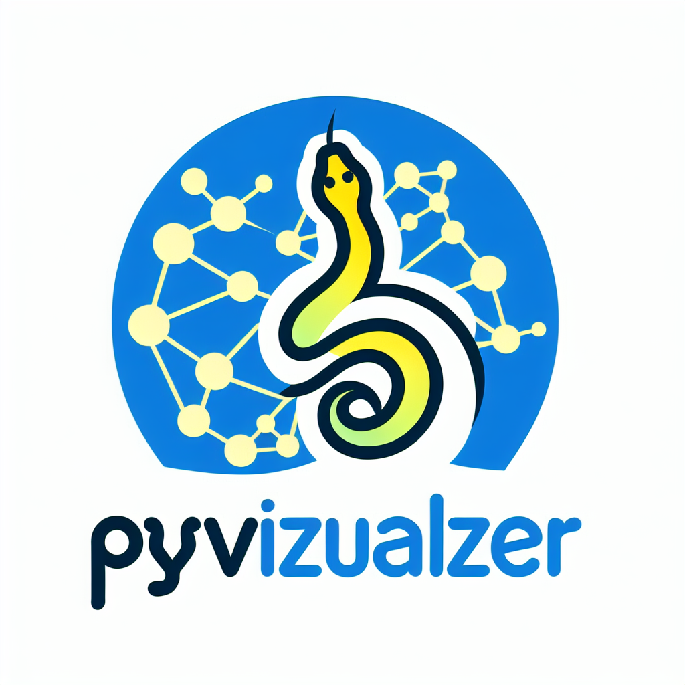

# PyVizualizer

[](https://badge.fury.io/py/pyvizualizer)
[](LICENSE)
[](https://pypi.org/project/pyvizualizer/)
[](https://github.com/yourusername/pyvizualizer/actions)

Visualize your Python project workflows with ease using **PyVizualizer**! This tool analyzes your Python codebase and generates beautiful [Mermaid](https://mermaid.js.org/) diagrams that depict the flow of methods and classes within your project, excluding external dependencies. Perfect for documentation, understanding complex codebases, and onboarding new team members.



## Table of Contents

- [Features](#features)
- [Installation](#installation)
- [Quick Start](#quick-start)
- [Usage](#usage)
  - [Command-Line Interface](#command-line-interface)
  - [Generating SVG Diagrams](#generating-svg-diagrams)
- [Examples](#examples)
- [Documentation](#documentation)
- [Contributing](#contributing)
- [License](#license)
- [Acknowledgements](#acknowledgements)

---

## Features

- **Automatic Code Analysis**: Parses your Python project to identify classes, methods, and their interactions.
- **Internal Workflow Visualization**: Focuses on your code, excluding external libraries, to provide a clear view of internal workflows.
- **Mermaid Diagram Generation**: Outputs diagrams in Mermaid syntax, which can be rendered as SVGs or embedded in Markdown files.
- **Command-Line Interface**: Easy-to-use CLI for quick integration into your workflow.
- **Future Scope**:
  - SVG image generation and integration into documentation.
  - Potential support for additional diagram types and customization options.

---

## Installation

PyVizualizer is compatible with Python 3.8 and above.

### Via pip (recommended)

```bash
pip install pyvizualizer
```

### From Source

Clone the repository and install:

```bash
git clone https://github.com/yourusername/pyvizualizer.git
cd pyvizualizer
pip install -e .
```

---

## Quick Start

Generate a Mermaid diagram of your Python project in seconds!

```bash
pyvizualizer /path/to/your/python/project
```

This command analyzes your project and creates a `diagram.mmd` Mermaid file in the current directory.

---

## Usage

### Command-Line Interface

PyVizualizer provides a simple CLI for ease of use.

```bash
pyvizualizer [OPTIONS] PROJECT_PATH
```

**Positional Arguments**:

- `PROJECT_PATH`: Path to the Python project directory you want to analyze.

**Options**:

- `-o`, `--output FILE`: Specify the output file for the Mermaid diagram. Default is `diagram.mmd`.
- `--log-level LEVEL`: Set the logging level (`DEBUG`, `INFO`, `WARNING`, `ERROR`, `CRITICAL`). Default is `INFO`.
- `-h`, `--help`: Show help message and exit.

**Example**:

```bash
pyvizualizer my_project/ --output my_project_diagram.mmd --log-level DEBUG
```

### Generating SVG Diagrams

To convert the Mermaid diagram into an SVG image:

1. **Install Mermaid CLI** (requires [Node.js](https://nodejs.org/)):

   ```bash
   npm install -g @mermaid-js/mermaid-cli
   ```

2. **Generate the SVG**:

   ```bash
   python scripts/generate_svg.py my_project_diagram.mmd my_project_diagram.svg
   ```

   Alternatively, use the Mermaid CLI directly:

   ```bash
   mmdc -i my_project_diagram.mmd -o my_project_diagram.svg
   ```

3. **View or Embed the SVG**:

   - Open `my_project_diagram.svg` in a web browser or SVG viewer.
   - Embed it in your `README.md` or documentation files.

---

## Examples

### Analyzing a Sample Project

We've included a sample project in the `examples/` directory.

```bash
pyvizualizer examples/sample_project --output sample_diagram.mmd
```

Generate the SVG:

```bash
python scripts/generate_svg.py sample_diagram.mmd sample_diagram.svg
```

### Visualizing Your Own Project

1. Navigate to your project directory:

   ```bash
   cd /path/to/your/project
   ```

2. Run PyVizualizer:

   ```bash
   pyvizualizer . --output my_diagram.mmd
   ```

3. Generate an SVG (optional):

   ```bash
   python -m pyvizualizer.generate_svg my_diagram.mmd my_diagram.svg
   ```

   Or use the Mermaid CLI:

   ```bash
   mmdc -i my_diagram.mmd -o my_diagram.svg
   ```

---

## Documentation

Detailed documentation is available in the [`docs/`](docs/index.md) directory, including:

- **User Guide**: Detailed instructions on using PyVizualizer.
- **API Reference**: For integrating PyVizualizer into other tools.
- **Contributing Guidelines**: How to contribute to the project.
- **FAQ**: Frequently asked questions.

---

## Contributing

We welcome contributions!

1. **Fork the Repository**: Click the "Fork" button at the top right of the repository page.
2. **Clone Your Fork**:

   ```bash
   git clone https://github.com/yourusername/pyvizualizer.git
   ```

3. **Create a Feature Branch**:

   ```bash
   git checkout -b feature/your_feature_name
   ```

4. **Make Your Changes**.

5. **Run Tests**:

   ```bash
   pytest tests/
   ```

6. **Commit and Push**:

   ```bash
   git add .
   git commit -m "Description of your changes"
   git push origin feature/your_feature_name
   ```

7. **Open a Pull Request**: Navigate to the original repository and click "New pull request".

Please read our [Contributing Guidelines](CONTRIBUTING.md) for more details.

---

## License

This project is licensed under the MIT License - see the [LICENSE](LICENSE) file for details.

---

## Acknowledgements

- **[Mermaid](https://mermaid.js.org/)**: Generation of diagrams.
- **[AST Module](https://docs.python.org/3/library/ast.html)**: For parsing Python code.
- **[Python Community](https://www.python.org/community/)**: For invaluable resources and support.

---

Made with ❤️ by [Syed Mohd Haider Rizvi](https://github.com/haider1998).

---

## Contact

- **Email**: smhrizvi281@gmail.com
- **GitHub**: [@haider1998](https://github.com/haider1998)
- **LinkedIn**: [Syed Mohd Haider Rizvi](https://www.linkedin.com/in/s-m-h-rizvi-0a40441ab/)

---

## FAQ

### **1. What versions of Python are supported?**

PyVizualizer supports Python 3.8 and above.

### **2. Does PyVizualizer execute my code?**

No, PyVizualizer uses Python's `ast` module to parse your code without executing it, ensuring safety.

### **3. Can I customize the generated diagrams?**

Currently, PyVizualizer focuses on generating standard Mermaid diagrams. Future versions may include customization options.

### **4. How does PyVizualizer handle external libraries?**

PyVizualizer excludes external library calls, focusing solely on the internal structure of your project.

---

## Troubleshooting

- **Problem**: *Mermaid CLI not found when generating SVG.*
  - **Solution**: Ensure you have installed Mermaid CLI globally using `npm install -g @mermaid-js/mermaid-cli`.

- **Problem**: *No output or empty diagram generated.*
  - **Solution**: Ensure your project path is correct and contains Python files. Run with `--log-level DEBUG` for more information.

---

## Changelog

### [0.1.0] - YYYY-MM-DD

- Initial release with core features:
  - Code parsing and analysis.
  - Mermaid diagram generation.
  - Command-line interface.

---

## Future Plans

- **SVG Generation Integration**: Automate SVG generation and embed diagrams into documentation.
- **Diagram Customization**: Allow users to customize diagram style and output formats.
- **Enhanced Analysis**: Include more detailed relationships and support for additional Python constructs.
- **Interactive Visualizations**: Explore the possibility of interactive diagrams.

---

## Support

If you encounter any issues or have suggestions, please open an [issue](https://github.com/yourusername/pyvizualizer/issues) on GitHub.

---

Thank you for using PyVizualizer! We hope it helps you understand and visualize your Python projects more effectively.